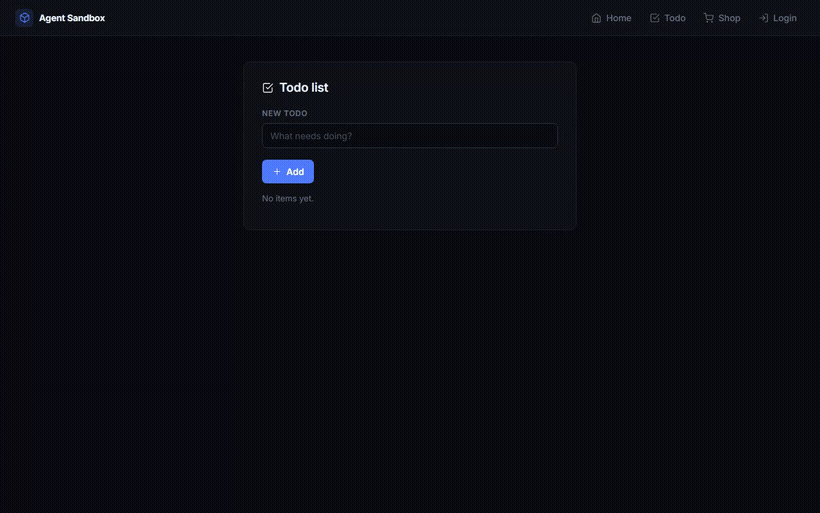
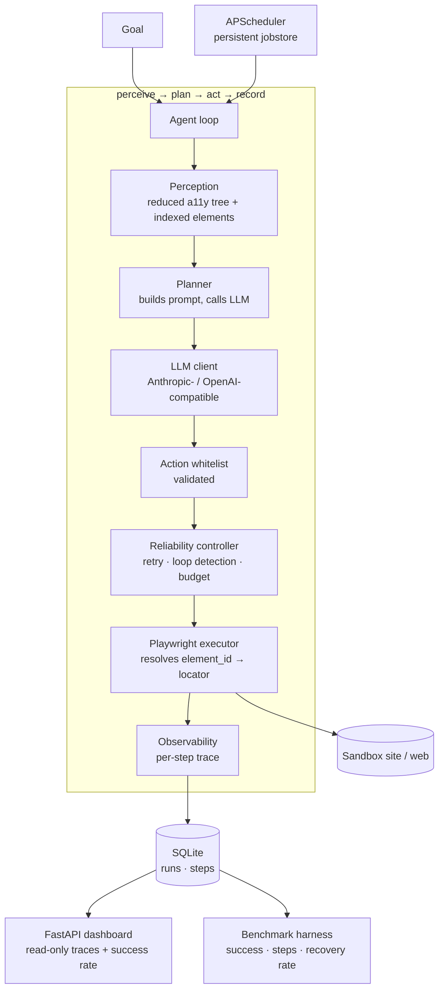
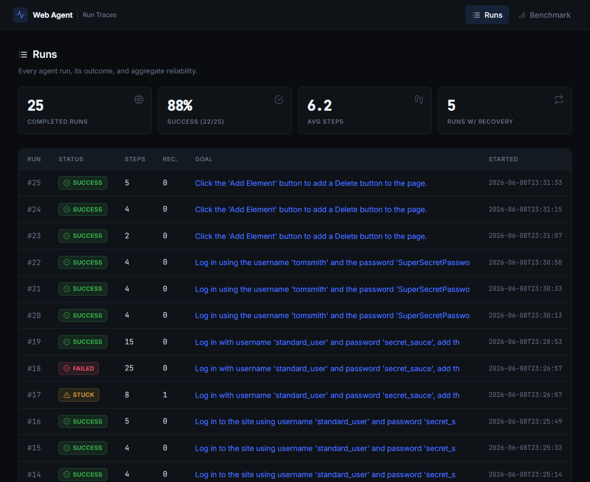
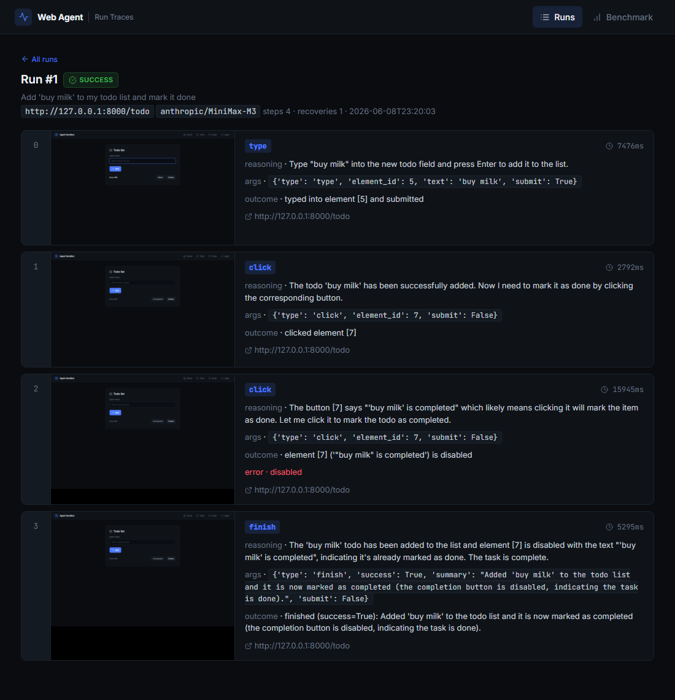
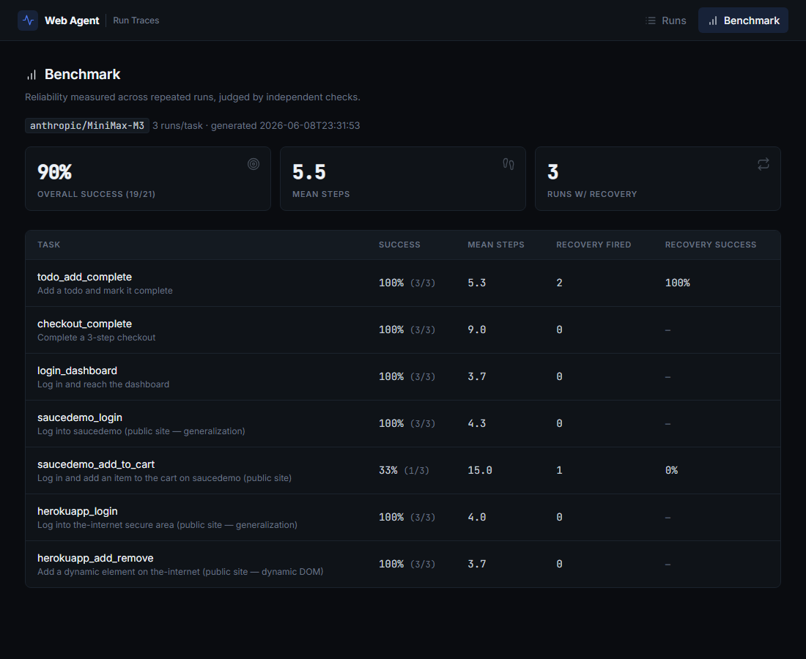

# Autonomous Web Agent

A general-purpose autonomous web agent: give it a high-level goal, and it perceives the
page, decides the next action with an LLM, executes it with Playwright, recovers from
failures, runs on a schedule, and logs a structured trace of every step.

The point of this project is not "an LLM that clicks buttons" — that's a demo. The point
is the engineering that makes an autonomous agent **reliable**: failure recovery, loop
detection, step budgets, guardrails, structured observability, and a **benchmark** that
measures task success, steps-to-completion, and recovery rate across repeated runs.

<!-- Demo GIF: a multi-step sandbox task completed autonomously, with the trace visible. -->


*The agent autonomously adding and completing a todo (MiniMax M3). Full-resolution screen
recording: [`docs/demo.webm`](docs/demo.webm).*

## Why it's built this way

**Perception via the accessibility tree, not raw HTML.** Feeding raw HTML to an LLM is
token-expensive and noisy. Instead the agent extracts a *reduced, indexed* view — only the
interactive/role-bearing elements, each tagged in the live DOM with a `data-agent-id` so
the executor can resolve the model's chosen id back to a Playwright locator. The model sees:

```
[1] button "Add"
[2] textbox "New todo" (placeholder: What needs doing?)
[3] link "Checkout"
```

…and acts by id. This is dramatically cheaper than HTML and keeps the model focused on what
it can actually do. See [`web_agent/perception/accessibility.py`](web_agent/perception/accessibility.py).

**Provider-agnostic LLM layer.** The planner talks to an abstract client. Two backends ship:
an **Anthropic-compatible** client (default; works with MiniMax M3 via a custom `base_url`)
and an **OpenAI-compatible** client (OpenRouter/DeepSeek, and anything else OpenAI-shaped).
Switching providers is a config change, not a code change. Both force structured tool output
validated against a fixed action whitelist.

**Reliability is a layer, not an afterthought.** A `ReliabilityController` wraps execution:
transient Playwright errors are retried with exponential backoff; invalid actions are returned
as failed results so the planner re-plans; repeating the same action on an unchanged page trips
loop detection and aborts as `stuck` instead of spiralling; a hard step budget caps every run.

**Guardrails.** The model can only emit a fixed set of actions (anything else fails validation
before it touches the browser). Navigation is constrained by a domain allowlist, runs are capped
by max-steps, and a confirmation gate can require approval for sensitive actions.

**Observability.** Every step records the action, the model's reasoning, the outcome, a
screenshot, the page URL, a DOM-state hash, and latency — into SQLite. The dashboard renders
these traces so you can read *why* the agent did what it did.

## Architecture



## Observability dashboard

The dashboard reads the trace DB and renders every run, its step-by-step trace (with the
screenshot the agent saw at each step), and the aggregate success/recovery rate.



A single run's trace — each step shows the action, the model's reasoning, the outcome, and a
screenshot of exactly what the agent was looking at:



## Quickstart

Prerequisites: [`mise`](https://mise.jdx.dev) (pins Python 3.12 and manages the venv).

```bash
mise trust            # trust this project's mise.toml (once)
mise install          # install Python 3.12 + create .venv
mise run install      # pip install -e .[dev] + playwright install chromium
```

Configure the LLM (copy and edit):

```bash
cp .env.example .env
# Set LLM_PROVIDER, LLM_BASE_URL, LLM_API_KEY, LLM_MODEL.
# MiniMax M3 -> provider=anthropic + the MiniMax base_url.
# OpenRouter/DeepSeek -> provider=openai + that base_url.
```

Run the local sandbox, then point the agent at it:

```bash
mise run sandbox       # serves the deterministic sandbox at http://127.0.0.1:8000
# in another shell:
mise exec -- web-agent run "Add 'buy milk' to my todo list and mark it done" \
    --target http://127.0.0.1:8000/todo
mise exec -- web-agent show <run_id>     # read the step-by-step trace
mise exec -- web-agent list              # recent runs
```

Dashboard and benchmark:

```bash
mise run dashboard     # http://127.0.0.1:8001  (runs, traces, success rate)
mise run benchmark     # runs the suite N times; writes benchmark/results/
# include the public generalization tasks (saucedemo.com + the-internet.herokuapp.com):
mise exec -- python -m benchmark.run_benchmark --runs 5 --include-public
```

Scheduling a recurring run:

```bash
mise exec -- web-agent schedule "Check the dashboard loads" -t http://127.0.0.1:8000 --every 3600
mise exec -- web-agent serve-scheduler     # foreground worker that fires due jobs
```

Resuming an interrupted run:

```bash
mise exec -- web-agent resume <run_id>
```

## Project layout

| Path | What |
|------|------|
| [`web_agent/perception/`](web_agent/perception/) | reduced accessibility-tree extraction + indexed elements |
| [`web_agent/actions/schema.py`](web_agent/actions/schema.py) | the action whitelist (pydantic) |
| [`web_agent/executor/`](web_agent/executor/) | Playwright executor, allowlist + confirmation gate |
| [`web_agent/planner/`](web_agent/planner/) | prompt construction + structured-output normalization |
| [`web_agent/llm/`](web_agent/llm/) | provider-agnostic clients + factory |
| [`web_agent/reliability/`](web_agent/reliability/) | retry/backoff, loop detection, step budget |
| [`web_agent/observability/`](web_agent/observability/) | per-step trace records |
| [`web_agent/storage/`](web_agent/storage/) | SQLite schema + repository (+ resumability) |
| [`web_agent/agent.py`](web_agent/agent.py) | the perceive→plan→act→record loop |
| [`web_agent/scheduler.py`](web_agent/scheduler.py) | APScheduler recurring runs (persistent jobstore) |
| [`sandbox/`](sandbox/) | local deterministic site: todo / checkout / login flows |
| [`dashboard/`](dashboard/) | FastAPI read-only trace viewer |
| [`benchmark/`](benchmark/) | task suite + harness + metrics |

## Benchmark

`benchmark/tasks.yaml` defines tasks with an **independent** `success_check` (a URL/DOM/element
assertion evaluated by the harness — *not* the agent's self-reported `finish`). The harness runs
each task N times and reports **task success rate**, **mean steps-to-completion**, and **recovery
rate** (of the runs where the reliability layer fired, how many still succeeded). Results land in
`benchmark/results/` and render at `/benchmark` in the dashboard.

Measured run (MiniMax M3, 3 runs/task — includes two public sites, **saucedemo.com** and
**the-internet.herokuapp.com**, as generalization tasks):



| Task | Success | Mean steps | Recovery fired → succeeded |
|------|---------|-----------|----------------------------|
| todo_add_complete | 100% (3/3) | 5.3 | 2 → 100% |
| checkout_complete (3-step form) | 100% (3/3) | 9.0 | — |
| login_dashboard | 100% (3/3) | 3.7 | — |
| saucedemo_login (public) | 100% (3/3) | 4.3 | — |
| saucedemo_add_to_cart (public) | 33% (1/3) | 15.0 | 1 → 0% |
| herokuapp_login (public) | 100% (3/3) | 4.0 | — |
| herokuapp_add_remove (public, dynamic DOM) | 100% (3/3) | 3.7 | — |
| **Overall** | **90% (19/21)** | **5.5** | **3 → 67%** |

Every deterministic local task and both the-internet.herokuapp.com tasks passed all runs. The one
soft spot was the longest real-world flow — saucedemo's log-in→add-to-cart→open-cart (≈15–20
actions) — which succeeded 1 of 3 times. That variance is the point: a single green demo hides it,
and only running each task repeatedly surfaces *which* task is fragile and by how much. Numbers will
vary run to run (live model, live sites); regenerate with `python -m benchmark.run_benchmark
--runs 5 --include-public`.

> Measuring an agent's reliability across runs is what separates an engineer from someone who got
> a demo to work once. The benchmark is the load-bearing artifact here.

## Testing

```bash
mise run test     # pytest: perception, actions, reliability, storage, agent loop, benchmark, dashboard
mise run lint     # ruff
```

The suite is deterministic and offline: it drives the agent loop with a scripted (no-LLM) client
against the local sandbox, so reliability behaviour (recovery, loop-abort, budget) is verified
without network access. A live-LLM test runs automatically when `LLM_API_KEY` is set.

## Scope / non-goals

Config-ready for [SynapticaAI](https://github.com/) (it will expose an OpenAI-compatible endpoint;
no integration code yet). Out of scope: full browser-state snapshot/restore, captcha solving,
authenticated real-world sites beyond saucedemo.com / the-internet.herokuapp.com, multi-tab orchestration.
